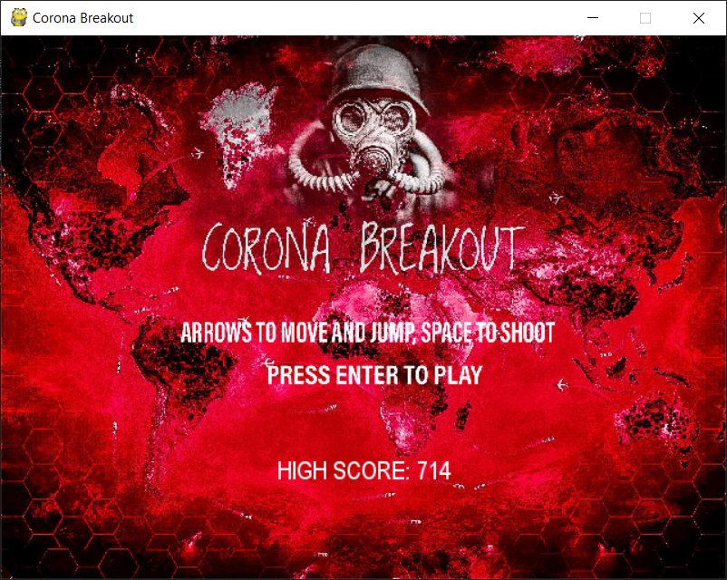
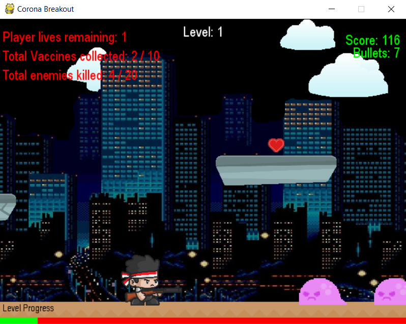
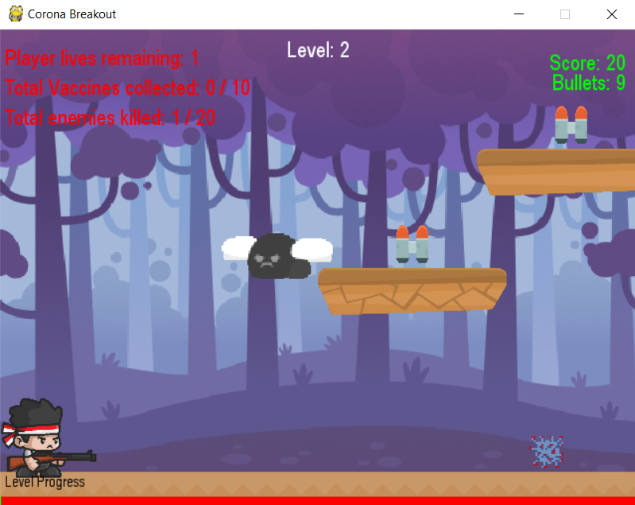

# Let's Code Coimbatore - Season 2

> Game development using Pygame. Let's Code for a Cause - COVID19

## Sections:
* [Team Members](#members)
* [Credits](#credits)
* [Installation](#installation)
* [How to Play](#guide)
* [For Developers](#developers)
* [Demo](#Demo)

---
## Members
* [Gautam J](https://github.com/Gautam-J, "Go to GitHub")
* [Lokesh Kumar Bhansali](https://github.com/Sai-Sid07, "Go to GitHub")
* [Sai Sidharth Sriram](https://github.com/lokeshkumarbhansali, "Go to GitHub")

## Credits
* [Yuva Bharathi Public School](https://www.yuvabharathi.in/ "Go to Website")
* [KGiSL Institute of Technology](https://www.kgkite.ac.in/ "Go to Website")
* [GUVI](https://www.guvi.in/ "Go to Website")
* Prof. Rajasekaran, KiTE
* Mr. Anand Jeyasingh, Yuva Bharathi Public School

## Installation
**NOTE:** PyGame is the only third party module needed to run the game.
* Clone the repo

    `git clone https://github.com/Bot-Interpreters/LCC-S2.git`

* Install PyGame

    `python -m pip install --user pygame`

    Alternatively, [requirements.txt](requirements.txt) can also be used.

* Run [main.py](main.py) to play the game.

## Guide
* **Story:**

    You, as a player, find out that the world is affected by the deadly COVID19 virus. Luckily, you meet up with a scientist who claims that he can find a cure if provided with necessary items. You decide to help him find a cure for the corona virus.

* **Mission:**

    You battle different kinds of viruses, killing them, and collecting vaccines in your way. As the game progresses, enemies become stronger, bats start to spawn, releasing the virus on you. Fight all kinds of viruses across four different levels, and providing the cure to the world.

* **How to Play**

    * Use the arrows keys on the keyboard to move your player, and to jump. Space bar can be used to shoot bullets to kill enemies. The game can be paused/unpaused by pressing the Escape key.

    * Collecting vaccines and powerups, and killing enemies will increase game score. Contact with enemies will reduce player life by one unit.

    * There are a total of four levels, with difficulty increasing as the game level increases. From level 2, we have Bats that releases corona virus on the player. If the virus touches the player, the game ends, no matter how many lives the player has. Only at level 4 will the player be able to destroy the virus.

    * Each level has some missions for the player to complete. Only then will the game move on to the next level.

    * Spend your resources wisely. You have limited amount of player health and ammunition. It can however be increased by collecting the respective powerups.

    * Level progress can be seen as a bar on the bottom of the screen, making the player know their current position on completion of the level. Other stats such as number of bullets, vaccines collected, enemies killed, and the overall game score can be seen at the top corners.

## Developers
**Pressing the F1 key will autocomplete the missions** on the current level, making it easier for the developer to continue to the next level, without spending time playing the game, and trying to complete it.

Open to changes. Can freely fork the repo, or create branches and give pull request. Suggestions and comments are welcome.

## Demo

